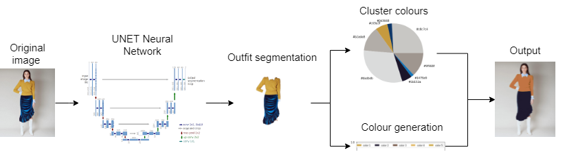
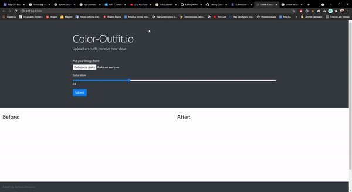
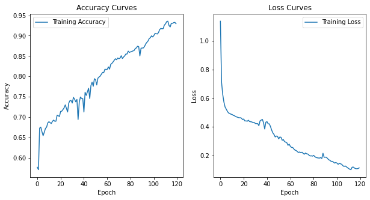

<h1 align="left">
   COLOUR-OUTFIT.IO 
</h1>

## Machine learning implementation of matching colours on outfit

Web-application which allows to try new matched colours on the new outfit. 
For each photo, specific outfit could be exctracted in order to obtain new colours to generate. 

## Running
python server.py 

## Key Features
* UNET architecture for image segmentation
* Trained on 200 pictures
* Accuracy 91%

## Main idea 

### Web page

### Accuracy

## Built With

* [Tensorflow](https://www.tensorflow.org) - machine learning library 
* [Google drive](https://www.google.com/drive) - storing all data 
* [OpenCV](https://opencv.org) - Computer vision and machine learning library 

## Authors
Arthur Zinnurov

## License
MIT
